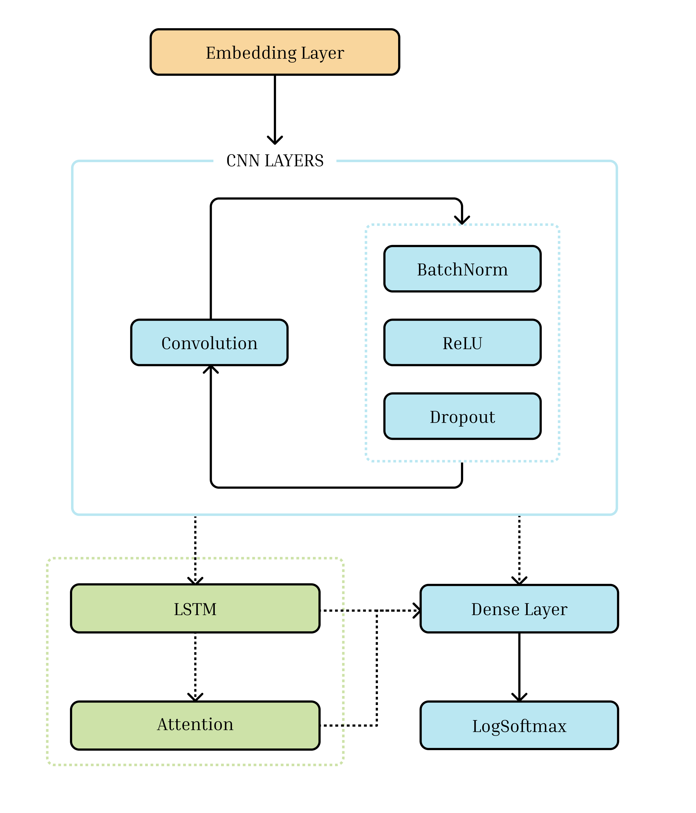

# Глоссирование нивхского языка

Сегментация через BIO-разметку

|модель  |  Accuracy  |  Word Accuracy        |
|--------|------------|-----------------------|
|**CNN** |  0.9713    |        **0.8645**     |
----------------------------------------------

